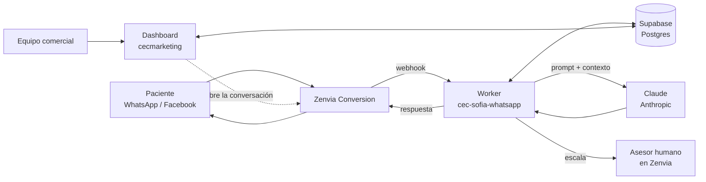
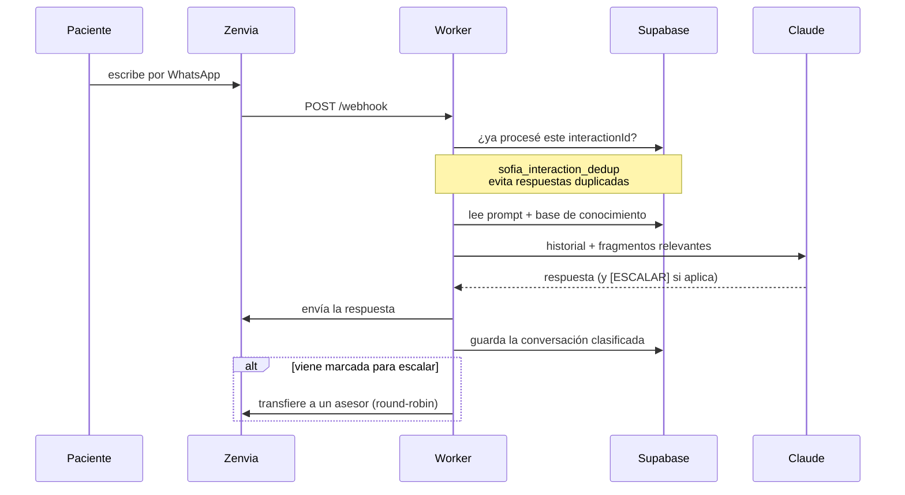
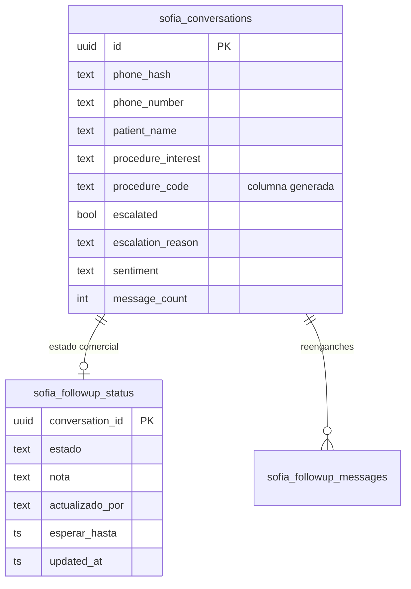
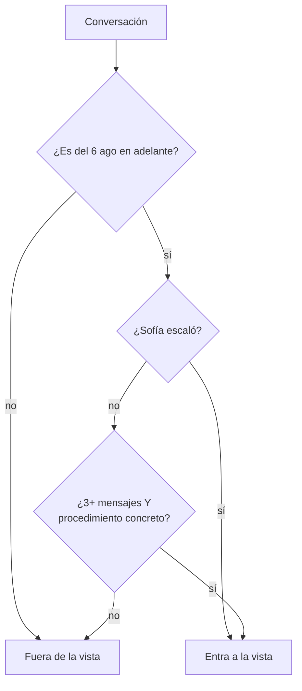

# Sofía — Documentación de funcionamiento

**Centro Europeo de Cirugía** · Actualizado 9 de septiembre de 2026
Cifras leídas de la base de datos de producción esa misma tarde.

---

## 1. Resumen

Sofía atiende por WhatsApp y Facebook a quien escribe al CEC. Responde con
información de una base de conocimiento propia, escala a un asesor humano
cuando corresponde, y deja cada conversación registrada y clasificada para que
el equipo comercial la trabaje desde un panel web.

| | |
|---|---|
| Primera conversación registrada | 27 de julio de 2026 |
| Conversaciones acumuladas | 12.342 |
| Personas distintas atendidas | 12.326 |
| Agosto (mes completo) | 9.016 |
| Septiembre (1 al 9) | 2.038 |
| Modelo que responde | Claude (Anthropic) |
| Canal | WhatsApp 80%, Facebook 20% |

### 1.1 Las dos piezas

El sistema son **dos aplicaciones separadas** que comparten una sola base de
datos. Es la distinción más importante de todo este documento, porque cada una
se despliega distinto.

| Pieza | Repositorio | Qué hace | Cómo se despliega |
|---|---|---|---|
| **Worker de WhatsApp** | `cec-sofia-whatsapp` | Atiende a los pacientes. Es el volumen real. | `npx wrangler deploy` — **manual** |
| **Dashboard** | `cecmarketing` | Panel web del equipo | Automático al hacer push a `main` |
| **Base de datos** | Supabase (proyecto *CEC Marketing*) | Único punto de encuentro | Migraciones aplicadas a mano |

> **Trampa conocida:** un `git push` NO despliega el Worker. Se ha confundido
> antes. Si se cambia el comportamiento de Sofía y no se corre `wrangler deploy`,
> los pacientes siguen recibiendo la versión anterior.

### 1.2 Comprobación: ¿son esos todos los repositorios?

Sí. El sistema son esos dos repositorios y nada más. Se comprobó de cuatro
formas independientes el 9 de septiembre:

| Comprobación | Resultado |
|---|---|
| Proyectos de Supabase en la cuenta | Uno solo, el de CEC Marketing |
| Tablas en esa base | 12, todas `sofia_*` más `profiles`. Ninguna tabla ajena. |
| Base de datos de cada sitio publicado en la cuenta | Cada uno apunta a la suya, distinta de esta |
| Registros de acceso de las últimas 24 h | El único origen de navegador es el dashboard |

La cuenta aloja otros proyectos sin relación con este sistema. Se revisaron uno
por uno y ninguno toca esta base de datos; no se detallan acá porque no forman
parte de Sofía.

> **Matiz importante.** Dos repositorios, pero la lógica de respuesta de Sofía
> vive **duplicada a propósito** dentro de ellos:
>
> - `cec-sofia-whatsapp/src/index.js` — el volumen real de pacientes.
> - `cecmarketing/functions/api/chat.js` — solo el widget público `/sofia` y el
>   botón "Probar a Sofía" del dashboard.
>
> Cualquier cambio de comportamiento (prompt, RAG, escalación) **hay que
> aplicarlo en los dos**. Arreglar solo `chat.js` no cambia nada para los
> pacientes de WhatsApp.

---

## 2. Arquitectura



### 2.1 Ciclo de un mensaje



---

## 3. Cómo decide Sofía qué responder

### 3.1 Fuentes de la respuesta

| Fuente | Dónde vive | Para qué |
|---|---|---|
| Prompt del sistema | `sofia_config.system_prompt` — 27.840 caracteres | Tono, reglas, qué no decir |
| Base de conocimiento | `sofia_config.knowledge_base` — 83.912 caracteres | Información completa del CEC |
| Fragmentos relevantes | `sofia_knowledge_chunks` (106 fragmentos) | Búsqueda semántica según la consulta |

La búsqueda de fragmentos usa vectores (`pgvector`) mediante la función
`match_sofia_chunks()`. Es **semántica, no exacta**: puede devolver contenido
del mismo rubro sin que hable del procedimiento preguntado. Por eso el prompt
obliga a verificar que algún fragmento mencione literalmente el tratamiento
antes de describirlo.

### 3.2 Reglas duras del prompt

- Trato de **usted**, siempre. Sin emojis.
- Máximo 4-6 líneas por mensaje.
- **No da precios de cirugía** en el primer contacto: el precio se define en la
  valoración.
- No inventa. Si el dato no está, lo dice y ofrece pasar con un asesor.
- Responde en el idioma en que le escriban.
- Las valoraciones quirúrgicas no se agendan sábados ni domingos.
- Si el paciente menciona embarazo, lactancia o cambio de peso activo, comunica
  la recomendación de esperar y escala.

### 3.3 Cuándo escala a un humano

Sofía marca `[ESCALAR: motivo]` al final de su respuesta. El sistema clasifica
el motivo en cuatro orígenes:

| Origen | Qué significa | Peso en el puntaje |
|---|---|---|
| `escalada_sin_cita` | Pidió precio, cita o valoración | +10 |
| `escalada_otro_motivo` | Escalación clínica real | +8 |
| `escalada_tecnica` | La disparó el sistema, no el paciente | 0 |
| `cerrada_sin_escalar` | Conversación real que no escaló | 0 |

---

## 4. Rutas y endpoints

### 4.1 Worker (`cec-sofia-whatsapp`)

La dirección del Worker está en `wrangler.toml` del repositorio; se omite acá.
Las rutas protegidas exigen su secreto correspondiente.

| Ruta | Método | Para qué |
|---|---|---|
| `/webhook` | POST | Entrada de mensajes desde Zenvia. **Es el corazón.** |
| `/health` | GET | Comprobación de vida |
| `/followup/sweep` | POST | Barrido de reenganche (protegido) |
| `/cleanup/scan-and-warn` | POST | Cierre por inactividad (manual, protegido) |
| `/cleanup/retry-pending` | POST | Reintento de cierres pendientes |
| `/send/birthday` | POST | Envío de plantilla de cumpleaños |
| `/sync/phones` | POST | Trae teléfonos reales desde Zenvia |
| `/stats/conversion` | GET | Estadísticas de conversión |
| `/stats/prospect-phones` | GET | Diagnóstico de cobertura de teléfonos |

### 4.2 Tareas automáticas (cron)

| Horario | Tarea | ¿Le escribe a pacientes? |
|---|---|---|
| Cada 20 min (`*/20`) | `retryStuckEscalations` — reintenta transferencias atascadas | No |
| Minutos 5, 20, 35, 50 | `runFollowupSweep` — reenganche | **Sí** |

El barrido de reenganche solo corre entre las **9:00 y 19:00 hora de Costa
Rica**, y está detrás del interruptor `sofia_config.followup_enabled`.

> **Los dos textos están duplicados** en `wrangler.toml` y en `src/index.js`
> (constantes `CRON_SEGUIMIENTO` y `CRON_REINTENTOS`), porque Cloudflare entrega
> el texto literal en `event.cron` y así es como el Worker distingue una tarea de
> la otra. Si dejan de coincidir, el Worker lo reporta como `CRON_DESCONOCIDO` en
> `wrangler tail`. Antes del 9 de septiembre no: un cron desconocido caía en
> silencio a la otra tarea y **el reenganche dejaba de correr sin aviso**.

### 4.3 Dashboard (`cecmarketing`)

Los endpoints cuelgan de la dirección del panel, que se omite acá igual que la
del Worker. Todos exigen sesión iniciada.

| Endpoint | Para qué |
|---|---|
| `/api/chat` | Widget público de Sofía y "Probar a Sofía" |
| `/api/meta-metrics` | Datos de Meta Ads |
| `/api/daily-analysis` | Análisis que cruza Meta con Sofía |
| `/api/audit-sofia` | Autoauditoría de calidad |
| `/api/conversion-stats` | Estadísticas de conversión |
| `/api/admin-users` | Alta y permisos de usuarios |
| `/api/reindex` | Reindexa la base de conocimiento |
| `/api/send-birthday` | Dispara el envío de cumpleaños |
| `/api/cleanup-scan` | Dispara la limpieza por inactividad |
| `/api/_auth` | Verificación de sesión (compartido) |

---

## 5. Base de datos

### 5.1 Tablas

| Tabla | Qué guarda | Filas |
|---|---|---|
| `sofia_conversations` | Una fila por conversación, clasificada | 12.342 |
| `sofia_followup_status` | Estado comercial de cada conversación | 865 |
| `sofia_followup_messages` | Mensajes de reenganche enviados | 197 |
| `sofia_config` | Prompt, base de conocimiento, interruptores | 1 (siempre id=1) |
| `sofia_knowledge_chunks` | Fragmentos con vector para búsqueda | 106 |
| `sofia_whatsapp_sessions` | Historial vivo por teléfono | — |
| `sofia_interaction_dedup` | Evita procesar dos veces el mismo mensaje | — |
| `sofia_reliability_events` | Fallas registradas | — |
| `sofia_recommendations` | Análisis periódicos | — |
| `sofia_audits` | Autoauditorías | — |
| `sofia_inactivity_cleanup` | Control de cierres por inactividad | — |
| `profiles` | Usuarios del dashboard y sus módulos | 6 |

### 5.2 Vistas

| Vista | Para qué |
|---|---|
| `sofia_followup_queue` | **La cola de trabajo.** Filtra, clasifica, puntúa y ordena. |
| `sofia_pacientes` | Una fila por persona (agrupada por teléfono) |
| `sofia_followup_candidates` | Vista anterior, en desuso |

### 5.3 Relaciones



> `sofia_followup_status` **ya no tiene columnas de asignación**. Tuvo
> `asignado_a`, `asignado_nombre` y `asignado_en` entre el 9 de septiembre por
> la mañana y esa misma tarde; se eliminaron junto con el reparto por asesor
> (ver 6.5).

### 5.4 Funciones propias

| Función | Para qué |
|---|---|
| `sofia_procedure_code()` | Clasifica el texto libre en un código de procedimiento |
| `match_sofia_chunks()` | Búsqueda semántica en la base de conocimiento |
| `sofia_home_stats()` | Cifras de la pantalla Inicio en una sola llamada |
| `sofia_cola_semanal()` | Ritmo semanal de la cola |
| `sofia_sync_derived_to_appointment()` | Marca la conversación cuando el estado pasa a "Agendó" |
| `sofia_set_phones()` | Carga teléfonos desde Zenvia |
| `current_user_is_admin()` | Control de permisos |

(El resto de funciones del esquema son de la extensión `pgvector`.)

---

## 6. La cola de seguimiento

Es donde el equipo comercial trabaja. La vista `sofia_followup_queue` hace todo
el trabajo pesado en la base de datos, no en el navegador.

**Estado al 9 de septiembre por la tarde:** 4.436 conversaciones en la vista,
de las cuales **3.590 pendientes**. Hay 20 marcadas urgentes (0,45%) y las 20
ya están trabajadas: ninguna urgente sigue pendiente.

### 6.1 Qué entra a la cola



El corte del 6 de agosto existe porque antes de esa fecha no se guardaba el
identificador que permite abrir la conversación en Zenvia.

> **La vista no filtra por estado.** Trae todo —incluidas las agendadas y las
> descartadas— y expone la columna `estado`; **quien filtra es la pantalla**,
> que por defecto muestra pendientes. Es deliberado: así los contadores de cada
> estado pueden sumar sobre el mismo universo, que es justo lo que fallaba antes
> del 9 de septiembre (P-01).

### 6.2 El puntaje (0 a 100)

| Criterio | Puntos |
|---|---|
| Cirugía | 35 |
| Aparatología (Ultherapy, BodyTite, toxina…) | 22 |
| Otro tratamiento identificado | 12 |
| 6+ mensajes | 25 |
| 4-5 mensajes | 20 |
| 3 mensajes | 14 |
| 2 mensajes | 8 |
| Sentimiento positivo / neutral / otro | 15 / 8 / 3 |
| Antigüedad: ≤2 d / ≤5 d / ≤10 d / ≤20 d | 15 / 11 / 7 / 3 |
| Intención explícita de precio o cita | 10 |

### 6.3 Urgencia: independiente del puntaje

El puntaje mide **valor comercial**. La urgencia mide **riesgo**, y va primero
siempre.

Se marca urgente cuando el motivo de escalación menciona: insatisfacción,
queja, reclamo, dirección o gerencia, complicación, infección, sangrado,
emergencia, otro cirujano, segunda opinión, mal resultado, demanda o abogado.

> Hoy marca el **0,45%** de la cola (20 de 4.436), y las 20 ya están
> trabajadas. **Si algún día pasa del 2%, se volvió ruido** y hay que apretar el
> criterio, no aflojarlo.

> **Ojo con "Agendó".** Marcarlo dispara un trigger que pone
> `derived_to_appointment = true` en la conversación. Hasta el 9 de septiembre
> la vista excluía esas filas, así que **las conversiones eran invisibles para
> todo lo que la consultara** — incluido el contador de la propia pantalla, que
> mostraba 0 mientras el indicador de arriba mostraba 76. Corregido: ahora
> filtra por estado, no por `derived_to_appointment`.

### 6.4 Estados

| Estado | Valor en la base | Significado |
|---|---|---|
| Pendiente | `pendiente` | Nadie lo ha trabajado. Es también el estado de toda conversación que aún no tiene fila. |
| Contactado | `contactado` | Hubo contacto, sigue abierto, sin cita |
| Agendó | `agendo` | Consiguió la cita. Sale de la cola. |
| En espera | `en_espera` | El paciente quedó de responder. Vuelve solo en 5, 15 o 30 días. |
| Descartado | `descartado` | Sin interés real. Sale de la cola. |
| No contactable | `no_contactable` | El número no sirve o pidió no ser contactado |

> El valor guardado es **`agendo`**, sin tilde y sin la "d" de "agendado".
> Consultarlo con otro nombre devuelve cero y parece que nadie agenda: pasó dos
> veces ya. Es la misma familia de error que P-01.

Reparto de la cola al 9 de septiembre por la tarde:

| Estado | En la cola | De ellas, urgentes |
|---|---|---|
| Pendiente | 3.590 | 0 |
| Descartado | 410 | 9 |
| Contactado | 346 | 7 |
| **Agendó** | **78** | 3 |
| En espera | 6 | 0 |
| No contactable | 6 | 1 |

La tabla `sofia_followup_status` tiene 865 filas y la cola 4.436 porque **solo
se crea fila cuando alguien toca la conversación**: las otras 3.575 son
pendientes que nadie ha tocado todavía.

Contadas sobre la tabla hay **79** agendadas, una más que en la cola. La
diferencia es una conversación del 2 de septiembre de dos mensajes que Sofía no
escaló, así que nunca cumplió los requisitos para entrar a la cola — y aun así
terminó en cita. Es un recordatorio útil: la cola es una priorización, no el
universo completo de oportunidades.

**"En espera" se vence sola.** No hay proceso que la despierte: la vista la
devuelve a pendiente al consultar, pasada la fecha.

### 6.5 Una sola lista compartida

Todo el equipo ve **la misma lista**, ordenada igual: primero lo urgente,
después por puntaje, después por fecha. No hay reparto ni conversaciones a
nombre de nadie.

- La lista **se actualiza sola** conforme cada quien trabaja, por suscripción en
  vivo a `sofia_followup_status`. Cuando alguien cambia un estado, a los demás
  les cambia en pantalla sin recargar.
- Cada tarjeta muestra **quién la trabajó por última vez** y cuándo, que es lo
  que evita el trabajo repetido.

> **Qué había antes y por qué se quitó.** Entre la mañana y la tarde del 9 de
> septiembre existió un reparto de 30 conversaciones por asesor, con caducidad a
> los 3 días. Se eliminó el mismo día: resultó difícil de entender y poco
> intuitivo para quien lo tenía que usar. La suscripción en vivo cubre el
> problema que el reparto pretendía resolver —que dos personas trabajen lo
> mismo— sin obligar a nadie a "pedir" su lista antes de empezar.

---

## 7. Reenganche automático

Cuando un paciente deja de responder, Sofía le escribe una vez para retomar.

| | |
|---|---|
| Modelo | Claude Haiku 4.5 |
| Frecuencia | 4 corridas por hora, de 9:00 a 19:00 CR |
| Lote por corrida | 8 conversaciones |
| Enviados hasta hoy | 197 |
| Interruptor | `sofia_config.followup_enabled` |

### 7.1 Las seis guardas

Ningún mensaje sale sin pasar por estas revisiones. Si alguna falla, se envía un
texto de respaldo genérico en vez del generado.

| Guarda | Rechaza |
|---|---|
| `vacio` | El modelo no devolvió texto |
| `muy_largo` | Más de 450 caracteres |
| `afirmacion_prohibida` | Promesas, promociones, garantías |
| `monto_en_el_texto` | Cualquier cifra de dinero |
| `sin_historial` | No hay conversación previa que retomar |
| `api_NNN` / `excepcion` | Falló la llamada al modelo |

> **Cambiado el 9 de septiembre:** el tope estaba en 320 y era la causa
> principal de mensaje genérico — 6 de los 9 respaldos del 8 de septiembre. El
> promedio real es 226 caracteres y 33 de 103 mensajes quedaron a menos de 60
> del tope. Rechazar un mensaje que menciona el procedimiento de la paciente
> para mandarle uno genérico que no lo menciona era cambiar algo bueno por algo
> peor. Las guardas de contenido no se tocaron.

### 7.2 Costo del sistema

El reenganche cuesta centavos, pero **no es el costo del sistema**. Cada mensaje
de paciente dispara dos llamadas a Claude: la respuesta (Sonnet) y la
clasificación de procedimiento y sentimiento (Haiku).

| Concepto | Mensual | Cómo se sabe |
|---|---|---|
| Claude — respuesta + clasificación | **~USD 320** | Facturación real: 10 recargas de $15 entre el 24-ago y el 7-sep |
| Reenganche automático | Centavos | Medido en `sofia_followup_messages` |
| Cloudflare + Supabase | Marginal | Planes básicos |
| Zenvia | **Sin medir** | No está a la vista; hay que buscarlo en la factura |

Sobre 9.016 conversaciones en agosto, los ~USD 320 equivalen a unos **3,5
centavos por conversación atendida**.

> Una auditoría anterior modelaba ~$88/mes porque contaba solo los tokens de
> entrada de una sola llamada. La segunda llamada —el clasificador Haiku, que
> corre en todas las conversaciones— no estaba contada en ningún lado.

---

## 8. El dashboard

| Sección | Para qué |
|---|---|
| Inicio | Cifras del mes y ritmo de la cola |
| Métricas Meta | Inversión y resultados de campañas |
| Métricas Sofía | Volumen, escalaciones, temas, calidad |
| Recomendaciones | Análisis que cruza campañas con conversaciones |
| **Seguimiento** | **Donde trabaja el equipo comercial** |
| Contactos | Directorio de todas las personas atendidas |
| Auditoría de Sofía | Autoevaluación de calidad de respuestas |
| Configurar a Sofía | Editor del prompt y la base de conocimiento |
| Probar a Sofía | Banco de pruebas sin afectar producción |
| Cumpleaños | Envío de la plantilla aprobada |
| Configuración | Usuarios y permisos (solo administradores) |

Los permisos se controlan por usuario en `profiles.allowed_modules`. Un valor
nulo significa acceso a todo.

### 8.1 Aviso de versión nueva

El equipo deja el dashboard abierto todo el día, y un navegador que cargó la
página el lunes sigue ejecutando el paquete del lunes. Solo entre el 8 y el 9 de
septiembre hubo doce despliegues, ninguno de los cuales llegaba a una pestaña ya
abierta.

Desde el 9 de septiembre, cuando se publica una versión nueva aparece un aviso
flotante abajo con un botón **"Recargar ahora"**.

| Aspecto | Cómo funciona |
|---|---|
| Cómo lo detecta | Compara la huella del paquete con que se cargó la pestaña (`index-XXXX.js`, la genera la propia compilación) contra la que anuncia el sitio en ese momento |
| Cada cuánto revisa | Cada 10 minutos, y **cada vez que la persona vuelve a la pestaña** |
| ¿Recarga solo? | **Nunca.** Alguien puede estar a medio escribir una nota; recargarle encima le borra el trabajo |
| ¿Se puede cerrar? | No. Mientras esté ahí el mensaje es cierto. Desaparece al recargar. |

No hace falta mantener un número de versión: la huella sale de la compilación.
Detalle de implementación en `src/hooks/useVersionNueva.js`.

> Se pide `/` y no `/index.html`: Cloudflare Pages responde a esa segunda ruta
> con un 308 hacia la primera.

---

## 9. Operación

### 9.1 Interruptores de emergencia

| Interruptor | Efecto |
|---|---|
| `sofia_config.whatsapp_enabled = false` | **Sofía deja de responder.** Los mensajes entran pero no se contestan. |
| `sofia_config.followup_enabled = false` | Se detiene el reenganche automático |

### 9.2 Cómo desplegar

```bash
# Dashboard: automático al mezclar a main
git push origin main

# Worker: MANUAL, no basta con el push
cd cec-sofia-whatsapp && npx wrangler deploy
```

### 9.3 Migraciones de base de datos

Aplicar **siempre** con `apply_migration` (MCP de Supabase) o el panel — nunca
con `execute_sql`, que no deja registro en el historial. Guardar el archivo en
`supabase/migrations/` con el nombre `<versión>_<nombre>.sql` usando la versión
real que devuelve Supabase.

> Este descuido ya causó un problema real: la vista `sofia_pacientes` corría con
> una columna que ninguna migración registrada creaba, así que recrear la base
> desde el historial dejaba la sección Contactos rota, sin ningún error que lo
> explicara. Corregido el 9 de septiembre.

Y una limitación de Postgres que ya costó un intento fallido: **`CREATE OR
REPLACE VIEW` no puede quitar columnas.** Para eliminar una hay que
`DROP VIEW` + `CREATE VIEW`, y volver a otorgar los permisos (`GRANT`) después,
porque el `DROP` se los lleva.

### 9.4 Verificar qué corre en producción

Para el **Worker** no sirve mirar `git log` ni la lista de despliegues. Hay que
ver una línea `SOFIA_USAGE` en `wrangler tail`. La mayoría de los eventos de
`/webhook` son acuses de Zenvia y salen sin logs, así que ver webhooks pasar no
prueba nada.

Para el **dashboard**: pedir `/`, sacar la huella del paquete
(`/assets/index-XXXX.js`) y buscar dentro de ese archivo. Dos trampas que ya
dieron falsos negativos:

- Buscar un texto que en el código fuente es una plantilla (`` `/?v=${...}` ``)
  no lo encuentra nunca: el minificador lo parte. Buscar trozos cortos e
  invariables, como el texto visible de la interfaz.
- La consola del navegador guarda errores viejos y hace creer que algo falla
  cuando ya está arreglado.

---

## 10. Límites conocidos

| Límite | Detalle |
|---|---|
| Ventana de WhatsApp | Pasadas 24 h no se puede escribir gratis. El CEC solo tiene aprobada la plantilla de cumpleaños. Por eso quien vuelve de "En espera" se **llama**, no se escribe. |
| Lo que pasa dentro de Zenvia | El sistema transfiere la conversación a un asesor con nombre, pero **no guarda lo que los asesores escriben**. Lo que ocurre después de la transferencia no queda registrado acá. |
| Nombre del paciente | Solo se guarda desde el 8 de septiembre. El histórico está vacío. |
| Costo de Zenvia | No está a la vista; hay que buscarlo en la factura. |
| Datos anteriores al 6 de agosto | No entran a la cola: falta el identificador para abrir en Zenvia. |
| `schema.sql` | Sirve para recrear la estructura, pero **no incluye datos** ni el prompt de Sofía. |

---

## 11. Puntos abiertos

Estado al 9 de septiembre de 2026, final del día.

| # | Punto | Estado |
|---|---|---|
| P-01 | Se creía que el equipo no usaba "Agendó". **Era un error de medición**: la vista excluía las conversaciones con `derived_to_appointment`, así que las conversiones eran invisibles. Hoy hay 79 citas registradas. | **Resuelto** 9-sep — la vista ya no las esconde |
| P-02 | El tope de 320 caracteres del reenganche era la causa principal de mensaje genérico: 6 de 9 respaldos del 8-sep. | **Resuelto** 9-sep — subido a 450 |
| P-03 | El texto del cron, duplicado entre `wrangler.toml` e `index.js`, podía desincronizarse y apagar el reenganche en silencio. | **Resuelto** 9-sep — ahora reporta `CRON_DESCONOCIDO` |
| P-05 | Las instrucciones del prompt mezclaban tú y vos, con riesgo de que el registro se filtrara a los mensajes al paciente. | **Resuelto** 9-sep — 31 formas unificadas, verificado con tráfico real |
| P-07 | El reparto de 30 conversaciones por asesor resultó difícil de entender y poco intuitivo. | **Resuelto** 9-sep — una sola lista compartida que se actualiza en vivo |
| P-08 | Una pestaña abierta seguía corriendo una versión vieja del dashboard sin que nadie se enterara. | **Resuelto** 9-sep — aviso de versión nueva (8.1) |
| **P-04** | **Capacidad.** Hay 3.590 conversaciones pendientes en la cola y entran ~4.000 al mes. El equipo son cuatro personas. | **Requiere decisión de gerencia** |
| **P-06** | **Costo de Zenvia.** Es el único costo del sistema que no está a la vista; hay que buscarlo en la factura. | **Requiere revisión** |

### Lo que se aprendió resolviendo P-01

Cuatro veces en dos días apareció el mismo patrón: **dos números que miden lo
mismo y no coinciden.**

| Caso | Un lado decía | El otro decía | Causa |
|---|---|---|---|
| Leads Potenciales vs Seguimiento | Puntaje alto | Puntaje medio | Dos fórmulas distintas |
| Encabezado vs contadores | "Su lista está vacía" | "Todos 8" | Dos definiciones de "mi lista" |
| Indicador vs contador | "Agendados: 76" | "Agendó: 0" | Uno lee la tabla, el otro la vista |
| Consulta directa a la base | "agendados: 0" | La pantalla: 79 | Se consultó `agendado`; el valor real es `agendo` |

El síntoma fue el mismo las cuatro veces y la lección también: **cuando dos
cifras que deberían coincidir no coinciden, una de las dos está mal — y hasta
saber cuál, no se puede sacar ninguna conclusión de negocio.** El tercer caso
llegó a un informe para gerencia como hallazgo antes de detectarse el error.
